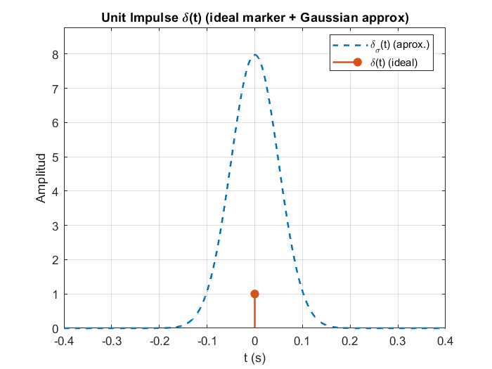

This repository contains a MATLAB script that generates and plots six fundamental continuous-time signals: unit impulse, unit step, unit ramp, exponential, signum, and sinc. Each figure has properly labeled axes and titles, and the code includes brief comments explaining the key steps.

---

## Included signals (short summary)

| Signal | Brief description | Typical expression |
|---|---|---|
| Unit impulse | Idealized instantaneous "hit"; not an ordinary function | delta(t) |
| Unit step | Switches from 0 to 1 at t=0 | u(t) with u(0)=0.5 (convention) |
| Unit ramp | Grows linearly from t=0 | r(t)=t*u(t) |
| Exponential | Growth/decay activated at t=0 | x(t)=exp(a*t)*u(t) |
| Signum | Indicates the sign of t | sgn(t) in {-1,0,1} |
| Sinc (normalized) | Pulse with decaying lobes | sinc(t)=sin(pi*t)/(pi*t), sinc(0)=1 |

> Note: In some MATLAB installations, the built-in `sinc` may be unavailable. The script includes an explicit equivalent implementation to avoid dependencies.

---

## Placeholders for figures

Below are suggested paths to save/link the generated plots. Replace these placeholders with the actual paths if you export figures to disk.

| Signal | Figure path (placeholder) |
|---|---|
| Unit impulse |  |
| Unit step |  |
| Unit ramp |  |
| Exponential |  |
| Signum |  |
| Sinc |  |

---

## How to run (section by section in MATLAB)

1. Open MATLAB and set your working folder to the project directory.
2. Open `Lecture2.m` in the MATLAB Editor.
3. The script is divided into code sections marked with `%%` (e.g., Unit Step, Unit Ramp, etc.).
4. To execute one section at a time:
   - Use Editor → Run Section, or press **Ctrl+Enter** (Windows/Linux) or **Command+Enter** (macOS).
   - To run the current section and move to the next, use **Ctrl+Shift+Enter** (Windows/Linux) or **Command+Shift+Enter** (macOS).
5. Run the sections in order (impulse, step, ramp, exponential, signum, sinc). Each section will open its corresponding figure.
